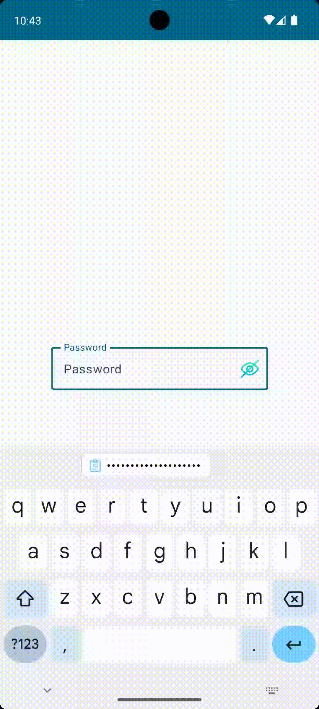
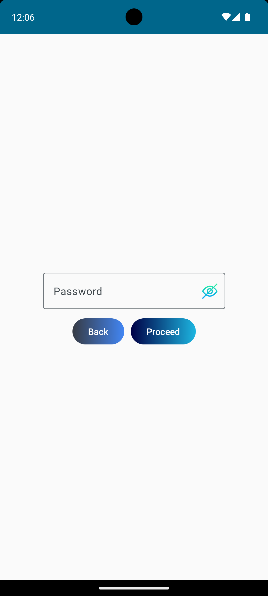
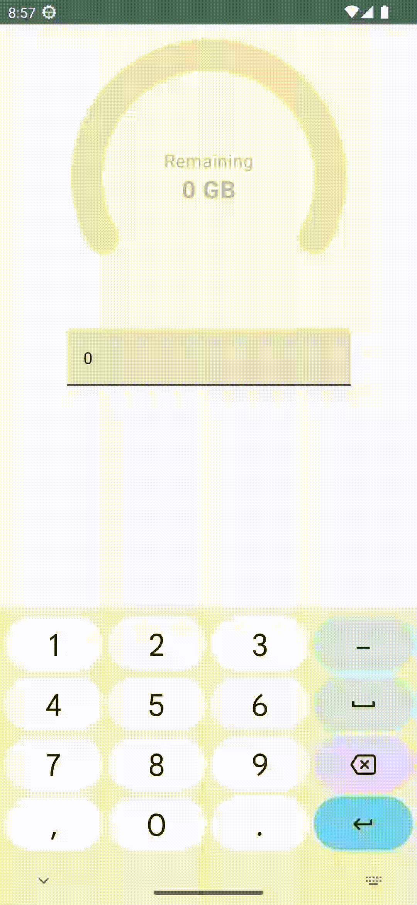
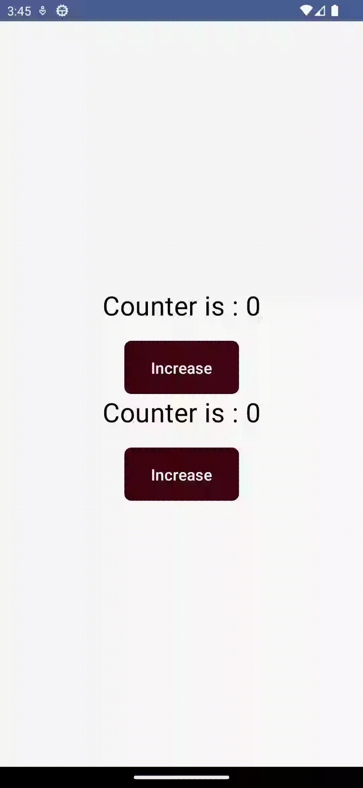

# Exploring Kotlin & Jetpack for modern Android apps: 100 Day Challenge:

### Description:

This document outlines my 100-day exploration of Kotlin and Jetpack Compose, where I'll build various practice projects to master essential skills and techniques. Each project will focus on specific areas, allowing me to track my progress and document my learning journey.

### Key Features:

- **State Management:** Utilizing Compose State and ViewModel for data handling and UI updates.
- **Navigation:** Implementing seamless navigation flows with Navigation Compose.
- **Animation:** Adding engaging and functional animations using Jetpack Compose Animation.
- **UI Development:** Leveraging various Jetpack Compose components like TextFields, Buttons, ListViews, and Custom components to build dynamic and intuitive UIs.
- **Material Design:** Adhering to Material Design principles for visually appealing and consistent user experiences.
- **MVVM Architecture:** Structuring projects efficiently using the Model-View-ViewModel architecture.
- **Data Acquisition:** Integrating with the Retrofit library for API calls and data fetching.
- **Image Loading:** Optimizing image loading and display using the Coil image library.
- **Data Storage:** Persisting data locally with the Room database.

### Technical Details:

- Each project will have a separate section within this document.
- I'll describe the project's main objective, skills practiced, key features, technical details, and learnings.
- Over time, this document will become a comprehensive record of my Kotlin and Jetpack Compose journey.
- **Programming Language:** Kotlin
- **UI Framework:** Jetpack Compose
- **Architecture:** MVVM
- **Data Storage:** Room Database
- **Additional Libraries:** Retrofit and Continued...

### Learning Points:

- Develop proficiency in various Kotlin and Jetpack Compose fundamentals.
- Build a collection of diverse and functional practice projects showcasing my skills.
- Gain valuable experience in software development best practices and problem-solving.
- Document my learning curve and reflect on my progress throughout the 100 days.

### Screenshots/Visuals:

<video src="https://github.com/Shahnawazk7944/Android_JetPack_Compose_Practice_Projects/assets/74444644/c190645a-4135-4e83-b69b-ab9e6bb4e7cf" height="400" ></video>

<video src="https://github.com/Shahnawazk7944/Simple_Age_Calculator/assets/74444644/9f800246-d1f4-43fe-9a06-35b4ac148606" height="400" ></video>

<video src="https://github.com/Shahnawazk7944/AI_Chat_Application_ZERU_With_MVVM_Retrofit_ROOM_GoogleGeminiAI/assets/74444644/1efcbf86-a22e-48fb-b88e-ec5c9045e060" height="400" ></video>

<video src="https://github.com/Shahnawazk7944/Android_JetPack_Compose_Practice_Projects/assets/74444644/fbd31533-233b-4a57-96d7-9310a8f14d34" height="400" ></video>

### SplitifyTask:

<video src="https://github.com/Shahnawazk7944/Android_JetPack_Compose_Practice_Projects/assets/74444644/3c3e7814-0958-4adf-be7e-0696645fd4aa" height="400" ></video>

